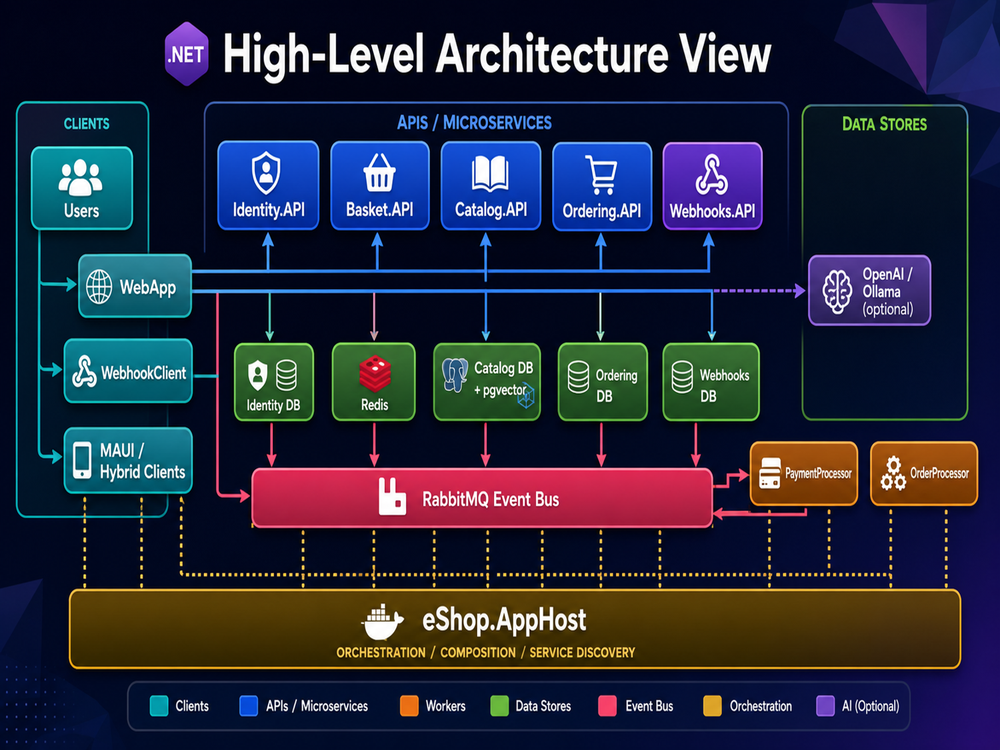

# eShop Web App

This repository contains the eShop application code base for the DevOps project.
The repo includes the application services, client apps, tests, build scripts,
container files, GitHub Actions workflows, and the supporting operational docs.

## DevOps Docs

- [Project overview](docs/project-overview.md)
- [DevOps overview](docs/devops-overview.md)
- [CI/CD flow](docs/cicd.md)
- [Environment model](docs/environments.md)
- [Testing strategy](docs/testing.md)
- [Operational notes](docs/operations.md)
- [Disaster recovery](docs/disaster-recovery.md)

## What This Repo Is For

This is the application-side source of truth for:

- Application code
- Build and test automation
- Container image creation
- Deployment triggers into GitOps
- Client and backend test coverage

## Architecture

## Original Project Architecture

This diagram shows the higher-level application, service, data, and orchestration
layout that the DevOps workflows support.

## Quick Orientation

- `src/` holds the app and service code
- `tests/` holds unit and functional test projects
- `e2e/` holds Playwright end-to-end tests
- `.github/workflows/` holds CI and deployment automation
- `build/` holds helper scripts for release and image workflows
- `docs/` holds the DevOps-focused documentation

## Repo Relationships

- `eshop-gitops` stores the Kubernetes desired state
- `eshop-infra` stores Terraform and platform infrastructure
- This repo publishes images and proposes GitOps updates

## Safety Notes

- Do not place secret values in documentation
- Use workflow secrets or a secrets manager for sensitive material
- Keep operational docs descriptive, not credential-specific
