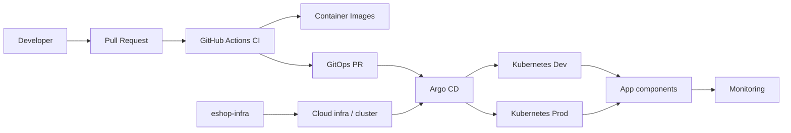

# Project Overview

This document explains the repository from a DevOps perspective.
It focuses on architecture, delivery, monitoring, security, and recovery.

## Architecture Diagram

## Tech Stack

- .NET
- ASP.NET Core
- MAUI
- Docker
- GitHub Actions
- Kubernetes
- Argo CD
- Terraform
- PostgreSQL
- Redis
- RabbitMQ
- Prometheus
- Grafana
- Trivy

## Setup Steps

1. Install the required .NET and Node.js tooling.
2. Restore dependencies.
3. Build the solution.
4. Run unit, functional, and end-to-end tests.
5. Review the deployment workflows and GitOps destinations.

## How To Deploy Dev And Prod

### Dev

- The Dev workflow builds the Web App image.
- It pushes the image to the registry.
- It updates the Dev GitOps manifest.
- Argo CD syncs Dev after the GitOps change is merged.

### Prod

- The Prod workflow follows the same pattern.
- It should be protected by a production approval gate.
- It updates the Prod GitOps manifest instead of Dev.
- The production release should stay traceable in commit history.

## CI/CD Explanation

This repo handles the application-side part of the release flow.

- PR workflows validate code before merge
- Build workflows create container images
- Deploy workflows promote Dev and Prod through GitOps
- Release changes should be traceable to a workflow run and a Git commit

## Monitoring Explanation

Monitoring is part of the platform, even when the dashboards live in GitOps.

This repo should explain:

- Which health endpoints the app exposes
- Which workflows support release confidence
- How monitoring is used after a rollout

## Security Considerations

- Use GitHub secrets for credentials
- Keep secret values out of docs
- Scan images with Trivy
- Keep Dependabot enabled
- Use least privilege for workflow permissions

## Disaster Recovery Notes

- Revert the GitOps change to roll back a release
- Rebuild images from source if a release must be reproduced
- Keep infrastructure and platform recovery in the infra and GitOps repos
- Document any data backup dependencies in the disaster recovery runbook

## Application Components

- Basket API
- Catalog API
- Identity API
- Ordering API
- Payment Processor
- Order Processor
- Webhooks API
- Web App
- Webhook Client
- Client App
- Hybrid App

## Infrastructure View

- The app repo produces images and release intent
- The infra repo provisions the platform
- The GitOps repo applies the desired state to Kubernetes

## Kubernetes View

- Dev and Prod are separate namespaces and promotion targets
- Workloads are deployed through manifests, not manual cluster edits
- Monitoring and recovery should be treated as part of the release process
